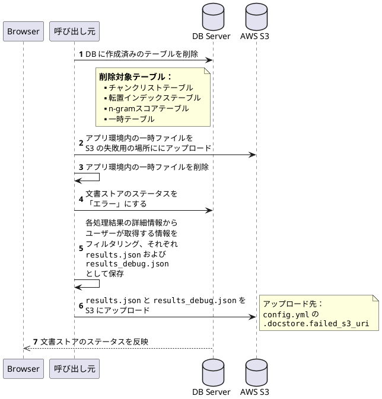

<!-- 情報種別のラベル -->

<div style="width: 300px; padding: 3px; margin-bottom: 3px; border: 1px solid; line-height:normal;">
    <font size="1">
        情報種別    G外秘<br>
        会社名      NTTデータ<br>
        情報所有者  ＤＴ事本デジサクユニット　Ｄ＆Ｉコンサルティング<br>
    </font>
</div>

<!-- 本文 -->

# オンライン処理設計書

* 作成者：小俣／深尾
* 作成日：2024/09/30／2024/10/21
* 更新者：松木
* 更新日：2024/12/09

## 文書ストア登録

### 概要

#### 機能

* ユーザがアップロードしたファイルを文書ストアとして登録する。
* 文書ストア登録画面にて、アップロード対象の ZIP ファイルと文書ストア名とグループをフォームに入力し、「アップロードして登録」を押下することで、新規文書ストアとしてファイルをアップロードを行う。
* アップロードするファイルは ZIP 形式とし、ZIP ファイル中の[「前提条件」節](#前提条件)記載の 5 種類の形式のファイルのみを文書ストアに含む。
* 設定ファイル (`config.yml`) で以下のパラメータを設定できる（テキスト化処理タイムアウトを除く）。
    * 文書ストア検索の挙動に影響を与えるもの
        * チャンク当たりの最大文字数 (`.doc_search.container_len`)
            * デフォルト：200
        * チャンク分割のずらし幅 (`.doc_search.container_shift`)
            * デフォルト：100
        * N-gram の N 値のリスト (`.doc_search.gram_n_ls`)
            * デフォルト：[1, 2, 4]
    * 文書ストア検索の挙動に影響を与えないもの
        * ZIP ファイルサイズ上限 [GiB] (`.docstore.max_zip_size`)
            * デフォルト：3
        * ZIP ファイル解凍後サイズ上限 [GiB] (`.docstore.max_unzipped_size`)
            * デフォルト：3
        * 環境内全文書ストア合計サイズ上限 [GiB] (`.docstore.max_total_size_of_all_docstores`)
            * デフォルト：20
        * 登録可能文書ストア数上限 [件] (`.docstore.max_total_files_of_all_docstores`)
            * デフォルト；20
        * 環境内 DB 合計使用容量上限 [GiB] (`.docstore.max_total_database_size`)
            * デフォルト：40
        * 文書ファイルサイズ上限 [GiB] (`.docstore.max_docfile_size`)
            * デフォルト：2
        * 文書ストア登録成功時のストア資材アップロード先 S3 URI (`.docstore.root_s3_uri`)
        * 文書ストア登録失敗時のストア資材アップロード先 S3 URI (`.docstore.failed_s3_uri`)
        * テキスト化処理タイムアウト [秒] (`.docstore.timeout_text`)
            * デフォルト：30
        * チャンク分割処理タイムアウト [秒] (`.docstore.timeout_chunk`)
            * デフォルト：3600
        * 転置インデックス構築処理タイムアウト [秒] (`.docstore.timeout_index`)
            * デフォルト：18000
        * 転置インデックス構築処理内ループあたりの処理チャンク数 (`.docstore.chunks_per_loop`)
            * デフォルト：300000
            * この値の変更による影響については[後述](#docstorechunks_per_loop-設定値について)する。

#### 操作範囲

* ユーザ全員が利用可能とする。
* 文書ストア毎に設定可能とする。(一般ユーザは、個人グループに紐づく文書ストア登録時に設定する。特権ユーザは、グループに紐づく文書ストア登録時に設定する。)
* 参照は文書ストア一覧画面上で行う。
* 登録は文書ストア登録画面上で行う。(変更したい場合は、同じ文書ストアを再登録する運用とする。)

#### 前提条件

* 事前に、複数の文書ファイル (新規作成する文書ストアに入れる文書ファイル群) を 1 つの ZIP ファイルに圧縮しておく。
* 文書ストアとして登録可能な対応ファイル形式は以下の 5 種類。
    * テキスト（`.txt`）
    * PDF（`.pdf`）
    * Word（`.doc`, `docx`）
    * PowerPoint（`.ppt`, `pptx`）
    * Excel（`.xls`, `xlsx`）

### 画面設計

<!-- FigmaへのURLパス -->

### 画面入力項目

| No | Name         | DataType              | notes                                                                         |
| -- | ------------ | :-------------------: | ----------------------------------------------------------------------------- |
| 1  | Zipファイル  | not null              | アップロードする ZIP ファイルを指定。<br>HTML の input (file 型) を使用する。 |
| 2  | 文書ストア名 | varchar(256) not null | 文書ストア名を入力                                                            |
| 3  | グループ     | not null              | 既存のグループから選択                                                        |

### 処理シーケンス

```plantuml
@startuml
skinparam responseMessageBelowArrow true
!pragma teoz true

participant "Browser" as B
participant "Web Server" as WS
participant "文書ストア登録用\n別プロセス" as CDS
database "DB Server" as DB
database "AWS S3" as S3

autonumber
B -> WS     : ZIP ファイル、\n文書ストア名、\nグループを送信
WS -> DB    : 文書ストア管理テーブルに文書管理情報を登録、\n文書ストアのステータスを「作成中」にする
note right
    === 文書ストア管理テーブル
    === ""docstore""
    登録情報：
    ** docstore_id
    ** docstore_name
    ** status
    ** uploader_user_id
    ** upload_datetime
    ** delete_flag
end note
WS -> DB    : 文書ストアとグループ関連情報テーブルに\n情報を登録する
note right
    === 文書ストアとグループ
    === 関連情報テーブル
    === ""rel_docstore_group""
    登録情報：
    ** docstore_id
    ** group_id
end note
WS -> DB    : DB 使用容量上限チェック
WS ->> CDS  : 新しい Python\nプロセスを起動
& note right CDS
    以下の処理は別プロセスで実行される
end note
WS -> B     : 文書ストア\n一覧画面に遷移\n（登録した\n文書管理情報が\n最上位行に\n追加される）
== 各ファイルのテキスト化 ==
CDS -> CDS  : ZIP ファイルの\n各エラーチェックを行う
CDS -> CDS  : テキスト化開始
activate CDS
note left CDS
    タイムアウト：
    ""config.yml"" の
    "".docstore.timeout_text""
end note
/ note left S3
    タイムアウト時間を超過した場合、
    処理を中止（キャンセル）し、
    文書ストア登録全体を終了する
    （以下も同様）
end note
' ||45||
CDS --> CDS : テキスト化終了
deactivate CDS
CDS -> CDS  : 文書情報をファイル出力
note over DB
    出力情報：
    各文書についての以下の情報
    ** アップロード後のファイルパス
    ** テキスト化後のファイルパス
    ** アップロード後のファイル名
    ** ID（""d0"", ""d1"", ...）
    **** 利用していない
    ** テキスト化の成功／失敗
    ** テキスト化失敗の場合のエラーメッセージ
end note
== チャンク分割 ==
CDS -> CDS  : チャンク分割開始
note left of CDS
    タイムアウト：
    ""config.yml"" の
    "".docstore.timeout_chunk""
end note
activate CDS
loop 文書ファイルごと
    CDS -> CDS : 文書のテキストを\nチャンクに分割
    opt チャンクが一定数以上貯まったら
        note over DB
            ここでの「一定数」は
            ""config.yml"" の
            "".docstore.chunks_per_loop""
            を流用する
        end note
        CDS -> DB : チャンクを DB に追加
        note over DB
            === チャンクリストテーブル
            <size:15>**""ds_chunk_list_""**</size>//<docstore_id>//

            |= chunk_ \n index |= chunk_text |= doc_\n index |= doc_\n name |
            | 0    | ダミーファイル0\n さんの出身地は... | 0 | 0.txt  |
            | 1    | 血液型はAB型\n です。ほげほげ... | 0 | 0.txt  |
            |   ⋮  | ⋮ | ⋮   | ⋮ |
            | 1000 | ダミーファイル1\n さんの出身地は... | 1 | one.pdf |
            | ⋮    | ⋮   | ⋮  | ⋮ |
        end note
    end
end
CDS -> DB   : チャンクリストテーブル\nのインデックスを作成
CDS -> DB   : DB 使用容量上限チェック
CDS --> CDS : チャンク分割終了
deactivate CDS
CDS -> DB   : 文書ストアの\nステータスを更新
== 転置インデックス構築 ==
CDS -> CDS  : 転置インデックス\n構築開始
activate CDS
note left of CDS
    タイムアウト：
    ""config.yml"" の
    "".docstore.timeout_index""
end note
/ note left S3
    ループごとの処理チャンク件数：
    ""config.yml"" の
    "".docstore.chunks_per_loop""
    （以下「**一定数**」と表記）
end note
loop チャンク一定数ごと
    CDS -> DB  : DB からチャンクを\n一定数取得
    DB --> CDS : チャンクを返却
    note right
        === チャンクリストテーブル
        <size:15>**""ds_chunk_list_""**</size>//<docstore_id>//
    end note
    CDS -> CDS : 各チャンクを n-gram に\n分解し、転置辞書を作成
    CDS -> DB  : 一定数のチャンク分の\n転置辞書を DB に追加
    note right
        === 転置インデックステーブル
        <size:15>**""ds_inverted_index_""**</size>//<docstore_id>//

        |= n_gram |= chunk_indices |
        | ほげ | [2, 3, 5, ...] |
        | ふが | [0, 99999] |
        | ⋮ | ⋮ |
        | ほげ | [100000, 100001, ...] |
        | ⋮ | ⋮ |
        | ぴよ | [200123, ...] |
        | ⋮ | ⋮ |
    end note
    CDS -> DB  : 各 n-gram の\n出現チャンク数を\nDB に追加
    note right
        ==== 一時テーブル temp_partial_count

        |= n_gram |= partial_cnt |
        | ほげ | 4 |
        | ふが | 2 |
        | ⋮ | ⋮ |
        | ほげ | 5 |
        | ⋮ | ⋮ |
        | ぴよ | 7 |
        | ⋮ | ⋮ |
    end note
    CDS -> DB  : DB 使用容量上限チェック
end
CDS -> DB   : チャンク件数を集計
note right
    ==== 一時テーブル temp_count

    |= n_gram |= cnt |
    | ほげ | 9 |
    | ふが | 3 |
    | ぴよ | 123 |
    | ⋮ | ⋮ |
end note
CDS -> DB   : スコアを計算
note right
    === n-gramスコアテーブル
    <size:15>**""ds_score_""**</size>//<docstore_id>//

    |= n_gram |= score   |= chunk_count |
    | ほげ    | 1.000000 | 9           |
    | ふが    | 1.123456 | 2           |
    | ぴよ    | 0.987654 | 123         |
    | ⋮       | ⋮         | ⋮           |
end note
& note left CDS
    計算式を SQL 文中に埋め込むことにより
    Python プロセスではなく DB サーバー上で
    計算処理を走らせている（以下の
    「スコア計算 SQL 文のイメージ」参照）
end note
CDS -> DB   : 転置インデックス、\nn-gramスコア\n各テーブルの\nインデックスを作成
CDS -> DB   : 一時テーブルを削除
CDS -> DB   : DB 使用容量上限チェック
CDS --> CDS : 転置インデックス\n構築終了
deactivate CDS
CDS -> DB   : 文書ストアの\nステータスを更新
== 後処理 ==
CDS -> CDS  : ""Fast_Doc_Searcher""\n設定値をファイル出力
CDS -> S3   : ストア資材を S3 にアップロード
note over S3
    送信ファイル：
    ** アップロードされた ZIP ファイル
    ** 解凍後のファイル
    ** テキスト化されたファイル
    ** ""Fast_Doc_Searcher"" 設定値
    ** 文書情報リスト
end note
CDS -> CDS  : アプリ環境の\nストア資材を削除
CDS -> DB   : ストア登録完了日時と\nZIP 解凍後サイズを\nDBに記録
note right
    === 文書ストア管理テーブル
    === ""docstore""
    登録情報：
    ** preprocess_completed_datetime
    ** original_filesize
end note
CDS -> DB   : DB 使用容量上限チェック
CDS -> DB   : 文書ストアのステータス\nを「利用可能」にする
note right
    === 文書ストア管理テーブル
    === ""docstore""
    更新情報：
    ** status
end note
CDS -> CDS  : 各処理結果の詳細情報から\nユーザーが取得する情報を\nフィルタリング、それぞれ\n""results.json"" および\n""results_debug.json""\nとして保存
CDS -> S3   : ""results.json"" と\n""results_debug.json"" を\nS3 にアップロード
note right
    アップロード先：
    ""config.yml"" の
    "".docstore.root_s3_uri""
end note
DB -->> B   : 文書ストアのステータスを反映
@enduml
```



#### ロールバック処理

文書ストア登録処理中、エラーが発生したりエラーチェックに失敗した場合は以下のロールバック処理を行う。



#### スコア計算 SQL 文のイメージ

転置インデックス構築処理ループごとの各 n-gram 出現チャンク数を DB テーブルに追加した後は、スコア計算に関するその後の処理（文書ストア全体での各 n-gram 出現チャンク数の集計やそれを基にしたスコアの計算）は DB 側で行い、LITRON-GA アプリ環境側の計算リソースを節約している。

特に、（過去の実装では Python コード上で実装していた）スコアの計算処理は、以下のような形で SQL 文に直接埋め込んでいる。

```sql
 ⋮
CASE
    WHEN CAST(cnt AS double precision) / {all_n} <= {med}
        THEN 1.2 - (CAST(cnt AS double precision) / {all_n}) * 0.2 / {med} 
        ELSE 1.0 - (CAST(cnt AS double precision) / {all_n} - {med}) * 0.2 / (1 - {med}) 
END AS score,
 ⋮
```

ここで、`cnt` は各 n-gram の出現チャンク数、`all_n` は全 n-gram の延べ出現チャンク数（`cnt` の和）、`med = 3.6e-07` である。上記 SQL 文は、各 n-gram の出現チャンク比率が 0 であれば 1.2, `med` であれば 1.0, 1 であれば 0.8 になるよう線形補間した値を計算するものである。

### `.docstore.chunks_per_loop` 設定値について

[「機能」節](#機能)記載のパラメータ「転置インデックス構築処理内ループあたりの処理チャンク数」(`.docstore.chunks_per_loop`) は、転置インデックス構築のメイン処理となるループ部分において 1 ループで処理するチャンクの件数を指定する設定値である。

現在のデフォルトは 300,000 である。この設定値を**大きく**した場合、次のような影響がある。

#### メリット

* DB 内に作成される転置インデックステーブルのサイズが小さくなる。
  * 結果として、転置インデックテーブルに対するインデックス作成やスコアテーブルに関する処理の際、DB サーバー側の空き容量枯渇によるエラー (`No space left on device`) が生じにくくなる。
  * （また、チャット時の文書検索に要する時間が多少減少するはずだが、現状ノイズレベルの差異しか見られない。）
* 転置インデックス構築処理にかかる時間が減少する。

#### デメリット

* 転置インデックス構築処理のメモリ使用量が増加する。
  * 結果として、程度や状況（複数の文書ストア登録が並列に実行されている、など）によっては文書ストア登録処理プロセス（LITRON-GA アプリ環境）がクラッシュする可能性がある。

#### 参考

`chunks_per_loop` を 100,000 と 300,000 に設定した場合の、1.5 GB のデータ (`本番想定ダミーファイル.zip`) を文書ストア登録した際の計測データを示す。

（以下、「転置インデックステーブル」を “**IIT**” と略記する。）

| `chunks_per_loop`                | `100000` | `300000` |
| -------------------------------- | -------: | -------: |
| IIT のサイズ [GiB] (**\*1**)     | 17.7     | 9.1      |
| IIT のインデックスサイズ [GiB]   | 1.5      | 0.6      |
| 文書ストア登録全処理所要時間     | 2:05:56  | 1:31:13  |
| （内、IIT 構築処理内の全ループ） | 1:27:30  | 1:14:26  |
| （内、IIT のインデックス作成）   | 0:31:27  | 0:11:35  |
| 最大メモリ使用量 [GiB] (**\*2**) | 4.2      | 9.1      |

**\*1**: インデックスを含まない
**\*2**: ストア資材アップロード時（5 GiB 前後）を除く

### エラー処理

以下に該当する場合、エラーメッセージを表示して処理を中止する。

#### 「アップロードして登録」ボタン押下後

以下のエラーではエラーメッセージが文書ストア登録画面に即座に表示される。

* 200 字を超える文書ストア名を入力した状態で「アップロードして登録」を押下した場合、メッセージ [<a id="1-from" href="#1">1</a>] を表示する。
* 選択したグループに対する文書ストア登録の権限がユーザーに無かった場合、メッセージ [<a id="2-from" href="#2">2</a>] を表示する。

#### DB への文書ストア情報新規登録後

以降のエラーメッセージは、文書ストア一覧画面に遷移後、文書ストア一覧の「ステータス」列の「エラー」のツールチップとして表示される。

* データベースの合計使用容量が「環境内 DB 合計使用容量上限」設定値（デフォルト：40 GiB）を超える場合、メッセージ [<a id="3-from" href="#3">3</a>] を表示する。
* アップロードされたファイルのサイズが「ZIP ファイルサイズ上限」設定値（デフォルト：3 GiB）を超える場合、メッセージ [<a id="4-from" href="#4">4</a>] を表示する。
* アップロードされたファイルの拡張子が（大文字・小文字を無視して）`.zip` でない場合、メッセージ [<a id="5-from" href="#5">5</a>] を表示する。
* アップロードされたファイルのアプリ環境への保存に失敗した場合、メッセージ [<a id="6-from" href="#6">6</a>] を表示する。

#### 文書ストア登録用別プロセス起動後

* アップロードされたファイルの実際の形式が ZIP ファイルでなかった場合、メッセージ [<a id="7-from" href="#7">7</a>] を表示する。
* ZIP ファイルの解凍後のサイズ（＝含まれる文書ファイルの合計サイズ）が「ZIP ファイル解凍後サイズ上限」設定値（デフォルト：3 GiB）を超える場合、メッセージ [<a id="8-from" href="#8">8</a>] を表示する。
* 解凍された全ファイルを追加することで環境内の全ての文書ストアのサイズの合計が「環境内全文書ストア合計サイズ上限」設定値（デフォルト：20 GiB）を超える場合、メッセージ [<a id="9-from" href="#9">9</a>] を表示する。
* 新規に文書ストアを登録することで環境内の全ての文書ストア数が「登録可能文書ストア数上限」設定値（デフォルト：20 件）を超える場合、メッセージ [<a id="10-from" href="#10">10</a>] を表示する。
* ZIP ファイルの解凍に失敗した場合、メッセージ [<a id="11-from" href="#11">11</a>] を表示する。
* 解凍された各ファイルについて、
  * `test.png` のような対応していない拡張子のファイルはスキップし文書ストアには含まない。
  * 結果、対応形式（[「前提条件」節](#前提条件)記載の 5 種類）のファイルが 1 つも残らない場合、メッセージ [<a id="12-from" href="#12">12</a>] を表示する。
* 対応形式の各文書ファイルについて、
  * 「文書ファイルサイズ上限」設定値（デフォルト：2 GiB）を超えるサイズのファイルはスキップし文書ストアには含まない。
    * スキップするのではなく、ひとつでも超過したファイルが存在したらエラーとする実装にする場合は、メッセージ [<a id="13-from" href="#13">13</a>] を表示する。
  * 結果、ファイルサイズ上限内のファイルが 1 つも残らない場合、メッセージ [<a id="14-from" href="#14">14</a>] を表示する。

#### 各ファイルのテキスト化処理

* 各ファイルのテキスト化において、内部的に [<a id="15-from" href="#15">15</a>] ～ [<a id="19-from" href="#19">19</a>] のコードを利用する。これらは画面には表示されない。
  * 結果、テキスト化に成功したファイルが 1 つも存在しない場合、メッセージ [<a id="20-from" href="#20">20</a>] を表示する。

#### チャンク分割処理

* チャンク分割処理に失敗した場合、メッセージ [<a id="21-from" href="#21">21</a>] を表示する。
* チャンク分割処理がタイムアウトになった場合、メッセージ [<a id="22-from" href="#22">22</a>] を表示する。
* チャンク分割後、データベースの合計使用容量が「環境内 DB 合計使用容量上限」設定値（デフォルト：40 GiB）を超える場合、メッセージ [<a href="#3">3</a>] を表示する。

#### 転置インデックス構築処理

* 転置インデックス構築に失敗した場合、メッセージ [<a id="23-from" href="#23">23</a>] を表示する。
* 転置インデックス構築がタイムアウトになった場合、メッセージ [<a id="24-from" href="#24">24</a>] を表示する。
* 転置インデックス構築後、データベースの合計使用容量が「環境内 DB 合計使用容量上限」設定値（デフォルト：40 GiB）を超える場合、メッセージ [<a href="#3">3</a>] を表示する。

#### 後処理

* アプリ環境のストア資材の AWS S3 へのアップロードに失敗した場合、メッセージ [<a id="25-from" href="#25">25</a>] を表示する。
* アプリ環境のストア資材の削除に失敗した場合、メッセージ [<a id="26-from" href="#26">26</a>] を表示する。
* DB への文書ストアメタデータの登録に失敗した場合、メッセージ [<a id="27-from" href="#27">27</a>] を表示する。
* 全処理の終了後、データベースの合計使用容量が「環境内 DB 合計使用容量上限」設定値（デフォルト：40 GiB）を超える場合、メッセージ [<a href="#3">3</a>] を表示する。

#### 予期せぬエラーが発生した場合

* 予期せぬ（実装上捕捉されない）エラーが発生した場合、メッセージ [<a id="28-from" href="#28">28</a>] を表示する。

### メッセージ

#### 文書ストア情報新規登録前

以下のエラーでは Name 列のテキストが文書ストア登録画面に即座に表示される。

| No                             | Name                                                           |
| ------------------------------ | -------------------------------------------------------------- |
| －                             | （文書ストア情報新規登録前）                                   |
| <a id="1" href="#1-from">1</a> | [BE-E-2001]文書ストア名は200文字以内で設定してください。                    |
| <a id="2" href="#2-from">2</a> | [BE-E-1004]グループに文書ストアを登録する権限がありません。                 |
| －                             | （文書ストア情報新規登録）                                     |

#### 文書ストア情報新規登録後

以下のエラーでは、文書ストア一覧画面に遷移後、文書ストア一覧の「ステータス」列の「エラー」のツールチップとして `detail_message` 列のテキストが表示される。
また、`DocstoreCreateError.message` 列のテキストがログに出力される。

| No                                | ステータスコード | `detail_message`                                                                              | `DocstoreCreateError.message`                                     |
| :-------------------------------- | ---------------- | --------------------------------------------------------------------------------------------- | ----------------------------------------------------------------- |
| －                                | (`S_0`)          | （文書ストア情報新規登録後）                                                                  |                                                                   |
| <a id="3" href="#3-from">3</a>    | `F_17`           | データベース合計使用容量の上限を<br>超過しました(合計40GBまで) **※**                         | －                                                                |
| <a id="4" href="#4-from">4</a>    | `F_0`            | アップロードされたzipファイルサイズが<br>上限を超えています(3GBまで) **※**                   | －                                                                |
| <a id="5" href="#5-from">5</a>    | `F_15`           | ZIP形式のファイル(.zip)を<br>アップロードしてください                                         | －                                                                |
| <a id="6" href="#6-from">6</a>    | `F_1`            | 内部エラー(F_1)                                                                               | －                                                                |
| －                                |                  | （別プロセス起動）                                                                            |                                                                   |
| <a id="7" href="#7-from">7</a>    | `F_4`            | 内部エラー(F_4)                                                                               | なし                                                              |
| <a id="8" href="#8-from">8</a>    | `F_2`            | アップロードされたzipファイルの<br>解凍後の合計サイズが<br>上限を超えています(3GBまで) **※** | なし                                                              |
| <a id="9" href="#9-from">9</a>    | `F_3`            | 登録可能な文書総容量を<br>超えています(合計20GBまで) **※**                                   | なし                                                              |
| <a id="10" href="#10-from">10</a> | `F_16`           | 登録可能な文書ストア数を<br>超えています(合計20件まで) **※**                                 | なし                                                              |
| <a id="11" href="#11-from">11</a> | `F_5`            | zipファイルの解凍に失敗                                                                       | `json.dumps(...)`                                                 |
| <a id="12" href="#12-from">12</a> | `F_8`            | 対応している拡張子のファイルが<br>1件も含まれていません                                       | なし                                                              |
| <a id="13" href="#13-from">13</a> | (`F_6`)          | 上限を超えるサイズの文書ファイルが<br>含まれています(2GBまで)                                 | 1ファイルのサイズ上限を超えています。<br>1ファイルサイズ上限: ... |
| <a id="14" href="#14-from">14</a> | `F_UNEXPECTED`   | 内部エラー                                                                                    | doc_ls の全てのドキュメントが<br>エラーになりました。             |
| －                                |                  | （各ファイルのテキスト化）                                                                    |                                                                   |
| <a id="15" href="#15-from">15</a> | `F_7_0`          | 内部エラー(F_7_0)                                                                             | `json.dumps(...)`                                                 |
| <a id="16" href="#16-from">16</a> | `F_7_1`          | 内部エラー(F_7_1)                                                                             | `json.dumps(...)`                                                 |
| <a id="17" href="#17-from">17</a> | `F_7_2`          | 内部エラー(F_7_2)                                                                             | `json.dumps(...)`                                                 |
| <a id="18" href="#18-from">18</a> | `F_7_3`          | 内部エラー(F_7_3)                                                                             | `json.dumps(...)`                                                 |
| <a id="19" href="#19-from">19</a> | `F_7_4`          | 内部エラー(F_7_4)                                                                             | `json.dumps(...)`                                                 |
| <a id="20" href="#20-from">20</a> | `F_UNEXPECTED`   | 内部エラー                                                                                    | doc_ls の全てのドキュメントが<br>エラーになりました。             |
| －                                | (`S_1`)          | （チャンク分割）                                                                              |                                                                   |
| <a id="21" href="#21-from">21</a> | `F_10`           | 内部エラー(F_10)                                                                              | `json.dumps(...)`                                                 |
| <a id="22" href="#22-from">22</a> | `F_10`           | 内部エラー(F_10)                                                                              | チャンク分割<br>タイムアウトエラー, timeout: ...                  |
| －                                | (`S_3`)          | （転置インデックス構築）                                                                      |                                                                   |
| <a id="23" href="#23-from">23</a> | `F_11`           | 内部エラー(F_11)                                                                              | `json.dumps(...)`                                                 |
| <a id="24" href="#24-from">24</a> | `F_11`           | 内部エラー(F_11)                                                                              | 検索インデックス構築<br>タイムアウトエラー, timeout: ...          |
| －                                | (`S_4`)          | （後処理）                                                                                    |                                                                   |
| <a id="25" href="#25-from">25</a> | `F_12`           | S3へのアップロードに失敗                                                                      | `e.args[0]`                                                       |
| <a id="26" href="#26-from">26</a> | `F_13`           | 内部エラー(F_13)                                                                              | なし                                                              |
| <a id="27" href="#27-from">27</a> | `F_14`           | 内部エラー(F_14)                                                                              | なし                                                              |
| －                                | (`S_COMPLETED`)  | （文書ストア登録処理終了）                                                                    | なし                                                              |
| －                                |                  | （予期しない（捕捉されない）エラー）                                                          |                                                                   |
| <a id="28" href="#28-from">28</a> | `F_UNEXPECTED`   | 内部エラー                                                                                    | なし                                                              |

なお、コード `F_9`, `S_2` はコーパス作成に関するコードとして用意されたもので、現在の実装にはコーパス作成処理が含まれないため利用されない。

※ これらのエラーメッセージ内の上限値は、設定ファイル (`config.yml`) で設定された実際の上限値で上書きされる。

### ACL制御

#### 文書ストア登録
以下権限を所有する場合、表示・操作可能

| ACL | 概要 |
| -- | ---- |
| LITRON_ADMIN | LITRONアプリ管理者 *1 |
| DOCSTORE_UPLOAD | 文書ストアアップロード *2 |

*1 常に可能。
*2 自身が所属しているグループにて該当ACLが付与されている場合のみ可能。

＊権限を所有しないユーザでアクセスした場合、前画面に遷移すること。
